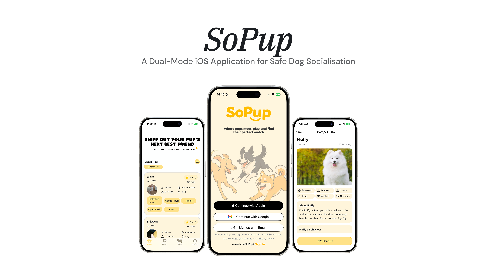
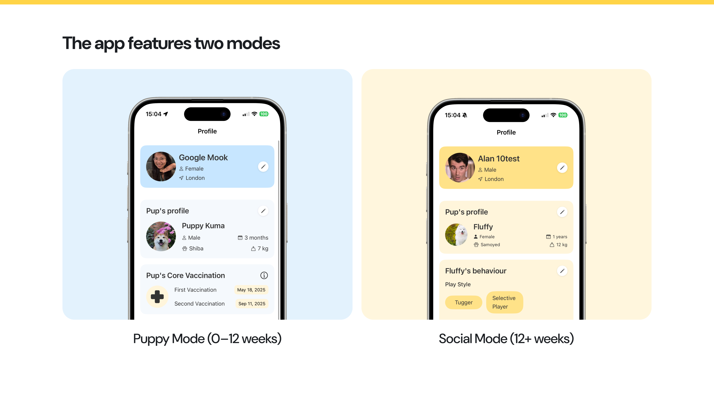
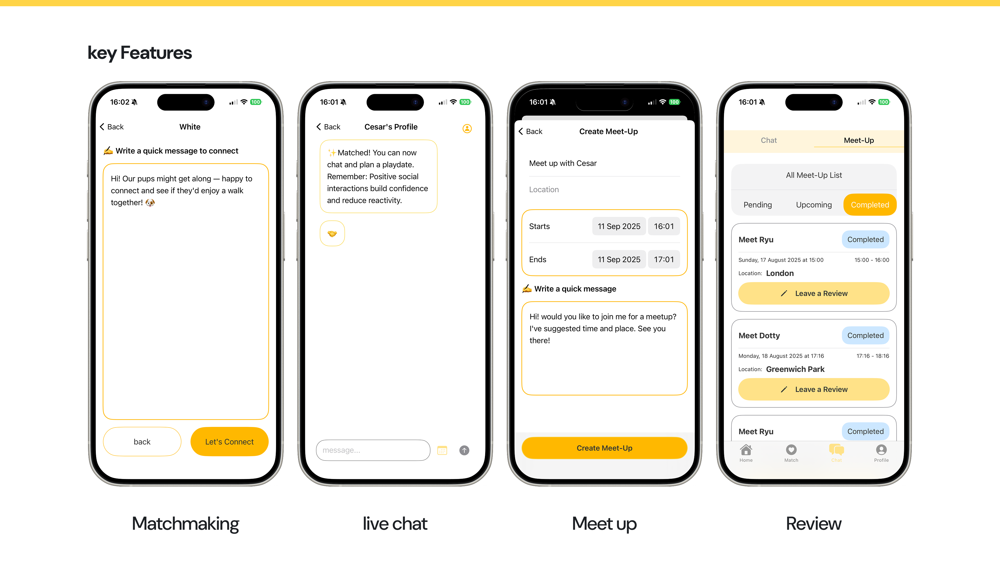

# 🐶 SoPup: A Dual-Mode iOS Application for Safe Dog Socialisation

This project was developed as part of an **MSc in Software Engineering** and focuses on **clean iOS architecture, real-time systems, and scalable backend design.**

## 🔗 Related link
- 🌐 **[Demo & Case Study](https://mpmookr.wixsite.com/mysite/sopup)**
The portfolio contains full UX flows, videos, system diagrams, and design decisions.

- 📦 **[Backend (Cloud Functions / Firebase)](https://github.com/MpmookR/SoPup_CloudFucntion)**

  

SoPup is a SwiftUI-based iOS application designed to support responsible dog socialisation, adapting the experience based on the dog’s age.

The app operates in two distinct modes:
- **Puppy Mode** (0–12 weeks): education, safety, and controlled exposure
- **Social Mode** (12+ weeks): matchmaking, chat, meet-ups, and reviews

  

  

## 🧠 Key Features
- Dual experience modes based on dog age (Puppy / Social)
- Location-aware dog matchmaking
- Real-time chat with meet-up requests
- Post-meetup review system
- Push notifications for matches, messages, and meet-ups