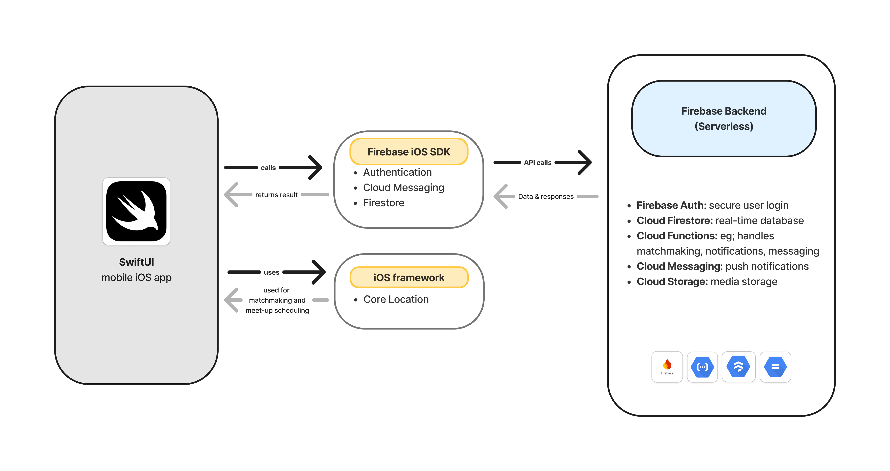
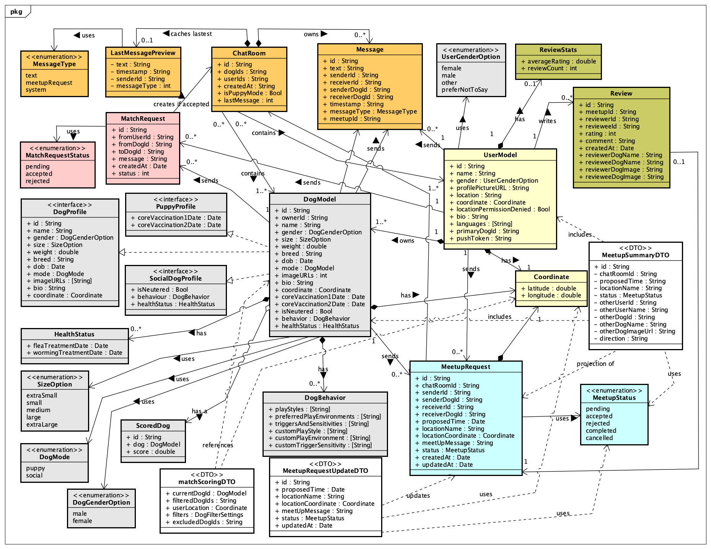
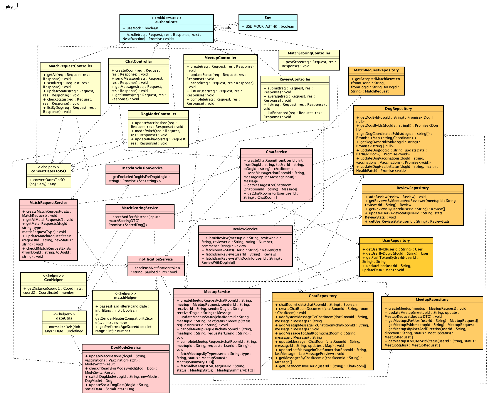
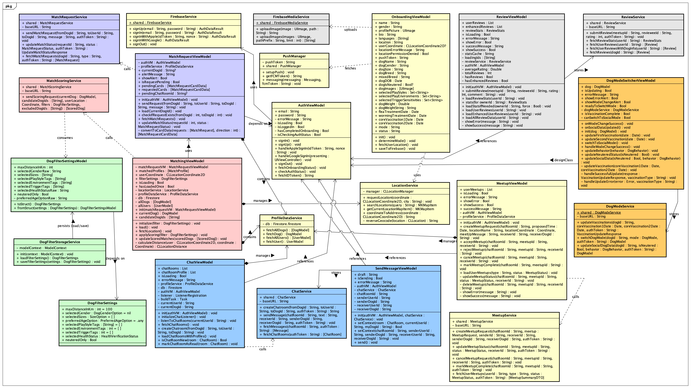
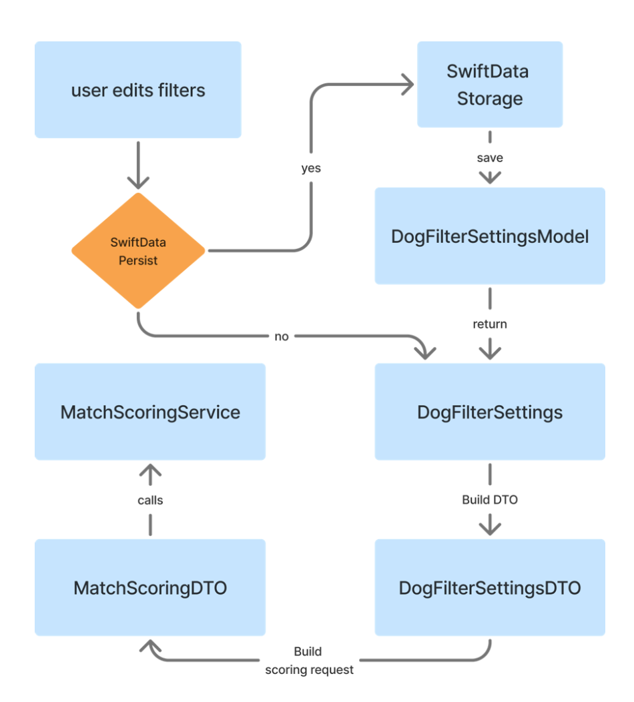
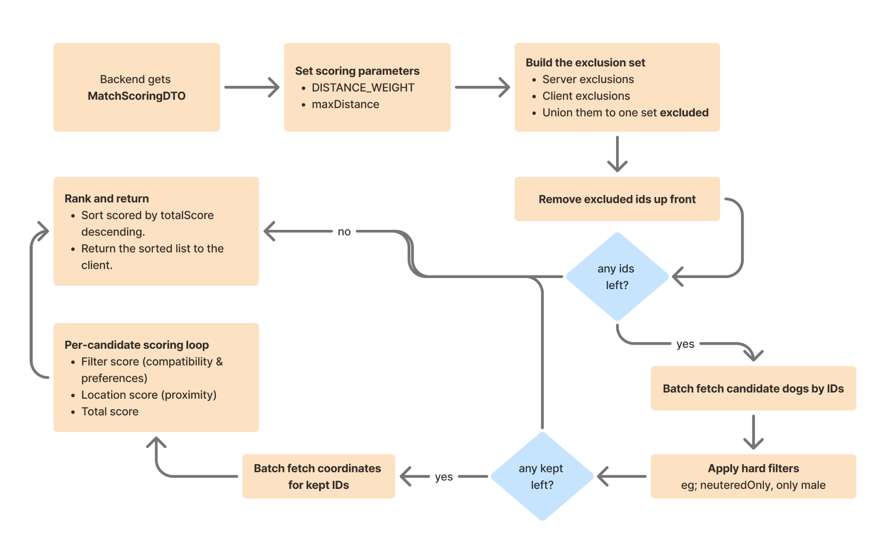
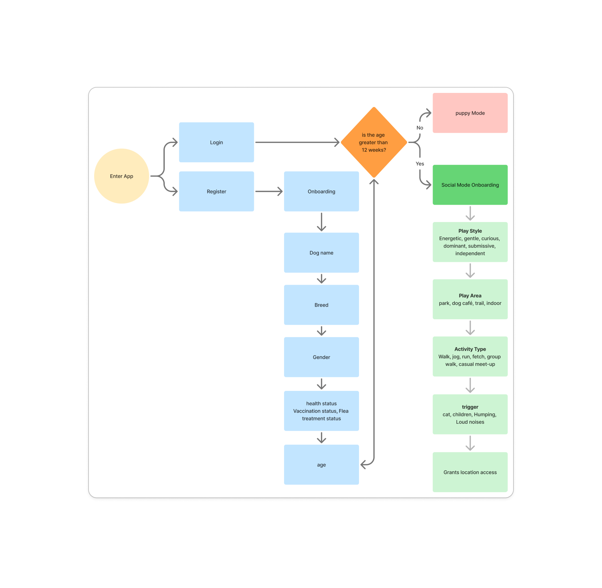
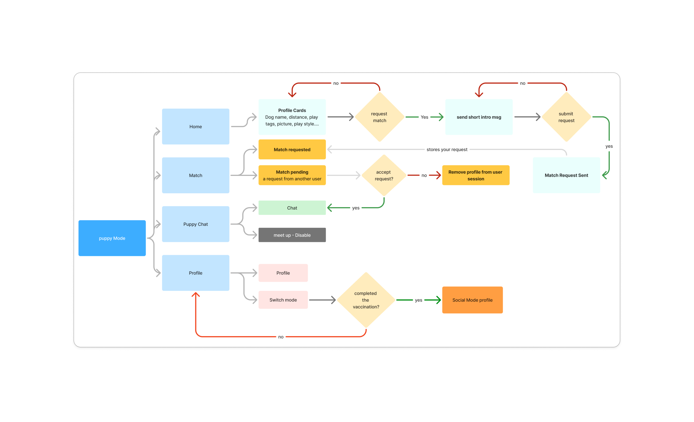
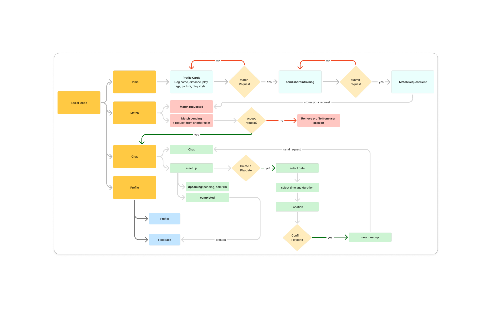

# 📐 SoPup: System Design

This document provides a deeper technical view of SoPup’s architecture and core workflows:
**authentication + onboarding**, **location-based discovery**, **matchmaking**, **chat + meet-ups**, and **post-meetup reviews**.

## System Overview

### Goals
- Support **safe dog socialisation** with age-based access:
  - **Puppy Mode (0–12 weeks):** education + safety constraints
  - **Social Mode (12+ weeks):** matchmaking, chat, meet-ups, reviews
- Ensure **real-time interactions** (requests, chat, status updates)
- Keep business rules **server-enforced** (Cloud Functions), not client-trusted
- Use push notifications to reduce polling and improve engagement

### High-level Architecture
- **SwiftUI iOS app** (MVVM + Clean Architecture)
- **Firebase Auth** (Apple/Google/Email)
- **Firestore** as the source of truth (real-time updates)
- **Cloud Functions (TypeScript)** for server-side business logic
- **FCM** for push notifications
- **Core Location** for distance-based discovery

  

## Key Components

### 2.1 iOS Client Responsibilities
- UI + navigation (SwiftUI)
- Local state management (ViewModels, SwiftData where applicable)
- Request initiation (e.g., send match request, send chat message)
- Permission handling (location, notifications)
- Rendering real-time Firestore streams

### 2.2 Backend Responsibilities (Cloud Functions)
- Validate and enforce business rules (mode gating, request state)
- Orchestrate side effects:
  - create chat room after acceptance
  - send push notifications via FCM
  - manage meet-up lifecycle status
  - compute/aggregate review averages
- Prevent unauthorised writes and client bypass

### 2.3 Firestore Responsibilities
- Store domain data (users, dogs, match requests, chats, meetups, reviews)
- Real-time sync for:
  - match request status
  - chat messages
  - meet-up updates
  - review availability

---

## Data Model (Conceptual)

  

The Domain Model Diagram establishes the conceptual language of the system
by defining its core entities, value objects, and relationships independently of any
implementation platform or database. It serves as the canonical schema for SoPup,
ensuring consistency across backend services and client-side view models.

### Core Collections (example)
- `users/{userId}`
- `dogs/{dogId}` 
- `matchRequests/{requestId}`
- `chatRooms/{chatRoomId}`
  - `chatRooms/{chatRoomId}/messages/{messageId}`
- `meetups/{meetupId}` 
- `reviews/{reviewId}`

🔎 Feel free to visit: [Data Models](https://github.com/MpmookR/SoPup_CloudFucntion/tree/main/functions/src/models)

---

## Backend Class Diagram

  

The backend class diagram specifies the organization of server-side
components that realise SoPup’s use cases. It shows how HTTP requests are validated,
authorised, transformed into domain operations, and persisted.

### Layered architecture

- **Controllers**: Stateless request handlers responsible for 
    - Input validation, 
    - Authentication/authorisation checks via middleware, 
    - Orchestration of service calls,
    - Translation of outcomes into HTTP responses and codes.

- **Services** (application/business layer)
    - Encapsulate domain rules for matching,chat, meet-ups, reviews, dog-mode transitions, and notifications. 
    - Services coordinate multiple repositories and enforce invariants 
        - e.g., duplicate-match prevention, puppy-mode restrictions, one-review-per-meet-up

- **Repositories**: Abstract access to Firestore collections for dogs, users, chatrooms/messages, meet-ups, reviews, and match requests. Repositories expose CRUD and query operations independent of transport and schema details.

- **Middleware and Helpers**: 
    - authenticate (Firebase ID token verification and user binding),
    - date/serialization utilities (e.g., convertDatesToISO), 
    - matching helpers, and exclusion logic.
---

## Client Class Diagram

  

The client diagram specifies the organization of SoPup’s iOS app components that realise user-facing flows. It demonstrates how view models coordinate presentation state, invoke application services, and consume backend APIs, while isolating device capabilities (such as location, push, and media)

### Layered architecture
- **Architectural style**: 
    - **Model-View-ViewModel** (MVVM) with a thin service layer. 
    - **Viewmodels** are UI-facing orchestrators. They hold reactive state (@Published), validate inputs, obtain ID tokens, invoke services, and map results/errors to user messages.
    - **services** encapsulate side effects(CloudFunction/Firebase/OS), 
    - **models/DTOs** carry data.
---

## Algorithmic Design

### Filter Persistence & Application (SwiftData, SwiftUI)

  

Keep user filter choices persistently while letting the UI and the scoring backend work with clean, enum-rich data.

### Score and Sort Matches (Backend)

  

Given a viewer’s dog, candidate dog IDs, user location and filters, return candidates
ranked by compatibility and proximity.

---

## User Flow Diagram

### Authentication & Onboarding Flow

  

### Puppy Mode Flow

  

🔸 **[Try Puppy Mode On Figma](https://www.figma.com/proto/cxcrc0qeORVgLmnGKOeDhn/SoPup?page-id=0%3A1&node-id=10-712&p=f&viewport=251%2C420%2C0.16&t=XrOfr5vW7gh56Mzd-1&scaling=scale-down&content-scaling=fixed&starting-point-node-id=10%3A712)**

### Social Mode Flow

  

🔸 **[Try Social Mode On Figma](https://www.figma.com/proto/cxcrc0qeORVgLmnGKOeDhn/SoPup?page-id=111%3A1833&node-id=111-1834&viewport=313%2C305%2C0.14&t=dBB2LbexYm78ETOl-1&scaling=scale-down&content-scaling=fixed)**

---

## Repository Links
🌐 **[Demo & Case Study](https://mpmookr.wixsite.com/mysite/sopup)**
🍎 **[Frontend iOS](https://github.com/MpmookR/So_Pup)**
📦 **[Backend (Cloud Functions/Firebase)](https://github.com/MpmookR/SoPup_CloudFucntion)**
⚙️ **[TestFlight](https://testflight.apple.com/join/duM8Wv9Q)**